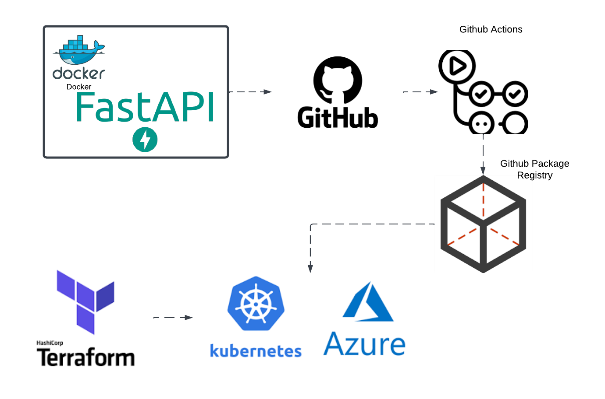

# DevOps Project: Python API to AWS Kubernetes
<span style="color:red">If you're here from the DevOps project video, please check the `resume_video` branch. The `main` branch has further commits.</span>

This project walks you through building a Python API, containerizing it with Docker, and automating the CI/CD pipeline with GitHub Actions. You'll then provision infrastructure using Terraform on AWS, deploy the API on an EKS (Elastic Kubernetes Service) cluster. This complete DevOps pipeline demonstrates key skills needed to land a job in DevOps and is a great addition to your portfolio.

You should not copy this, but model after it and customize to fit your interests.



## Python
```
python3 -m venv venv
source venv/bin/activate
python3 -m pip install -r requirements.txt
cd app
uvicorn main:app --host 0.0.0.0 --port 8080
```

## Docker
```
docker run -d --name devops-python -p 8080:80 devops-python
docker build -t devops-python .
```

Replace your github username in the github action variable [here](./.github/workflows/release.yaml)


<span style="color:red">Note: By default your action can't deploy to ghcr. Go to settings > actions > general > workflow permissions > Read and write permissions</span>

# Terraform and Kubernetes
<span style="color:red">Need to set your own variables for Azure Access in terraform/variables.tf</span>

Reference Guide: https://github.com/hashicorp/terraform-provider-kubernetes/blob/main/_examples/aks/main.tf

Deploy

```
az login
tf init
tf apply
```

Check Pods

```
export KUBECONFIG="./kubeconfig"
kubectl get pods -A+
```

## Port Forward
```
kubectl port-forward -n api svc/api-service 8080:80
```
## Prometheus & Grafana
kubectl port-forward svc/prometheus-community-grafana 8080:80

kubectl port-forward svc/prometheus-community-kube-prometheus 9090